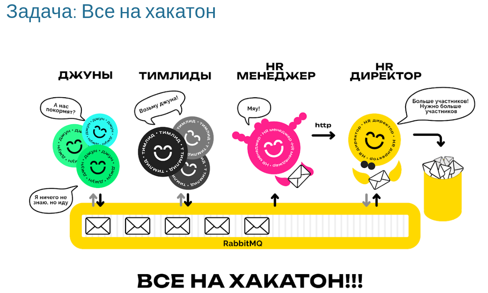
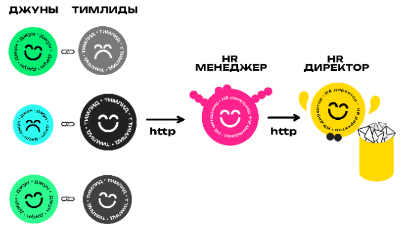

# sharp_course
It's a repo for C# labs
Done 3 labs.

## TASK "ВСЕ НА ХАКАТОН" ##


В одной IT компании захотели сформировать команды мечты (DreamTeam). Для этого начинающий HR менеджер (HRManager) предложил умудрённому опытом HR директору (HRDirector) провести хакатон (Hackathon).

На хакатон позвали 20 джунов (Junior) и 20 тимлидов (TeamLead). Разработчикам предложили поработать вместе и к концу мероприятия составить списки коллег (Wishlist), с которыми они хотели бы работать в одной команде. Каждый джун составляет список из 20 тимлидов, ставя на первое место наиболее предпочтительного кандидата, на второе следующего по предпочтительности и далее по убывающей. Тимлиды, в свою очередь, таким же образом оценивают джунов. Все списки должны состоять из 20 пунктов, пункты не должны повторяться. В списках тимлидов могут быть только джуны, в списках джунов только тимлиды.

Все эти списки передаются нашему начинающему HR менеджеру, который уже пообещал придумать инновационную стратегию формирования команд мечты. Каждая команда должна состоять из пары: Тимлид + Джун. Список команд он передаст HR директору.

Все было бы просто, но умудрённый опытом HR директор придумал как математически точно оценить гармоничность команд. Для этого он предложил посчитать индекс удовлетворённости каждого из разработчиков. Например, если тимлиду попался наиболее желаемый джун, то он получает 20 очков удовлетворённости, если второй по списку, то 19 и т.д. вплоть до 1. Точно так же рассчитывается индекс удовлетворённости джунов их тимлидами.

Далее HR директор подсчитывает среднее гармоническое индексов удовлетворённости всех участников. Именно это число HR директор предложил считать гармоничностью распределения. Основная цель начинающего HR менеджера при выборе стратегии распределение по командам – чтобы гармоничность мероприятия была как можно выше.

Хакатон проводится несколько раз. Необходимо вычислить среднюю гармоничность как среднее арифметическое по всем мероприятиям, т.е.  вычислить среднее арифметическое средних гармонических.

## Задача 1: ООП ##
Реализовать консольное приложение, списки предпочтений определяются случайно. Списки участников необходимо считывать из файлов (Juniors20.csv и Teamleads20.csv), файлы взять из репозитория https://github.com/georgiy-sidorov/CSHARP_2024_NSU/tree/main

Хакатон проводится 1000 раз. Приложение должно вывести в консоль уровень гармоничности по всем 1000 мероприятиям, а также среднее по всем.

*Само приложение не должно скачивать файлы с github во время работы, нужно скачать их и разместить рядом с исходным кодом решения.*


## Задача 2:.Net Generic Host ##
Поместить песочницу в .Net Generic Host. Выделить в отдельные зависимости:
- Класс, реализующий проведение одного хакатона;
- Класс, реализующий HRManager;
- Класс, реализующий HRDirector;
- Стратегию HRManager.

Например, инициализация хоста может выглядеть следующим образом

```
using Microsoft.Extensions.DependencyInjection;
using Microsoft.Extensions.Hosting;

var host = Host.CreateDefaultBuilder(args)
        .ConfigureServices((hostContext, services) =>
  {
            services.AddHostedService<HackathonWorker>();
            services.AddTransient<Hackathon>(_ => new Hackathon());
            services.AddTransient<ITeamBuildingStrategy, TeamLeadsHateTheirJuniorsTeamBuildingStrategy>();
            services.AddTransient<HrManager>();
            services.AddTransient<HrDirector>();
    }).Build();

host.Run();
```

## Задача 3: Тестирование ##
Реализовать следующие unit-тесты:

- Генерация Wishlist:
    - Размер списка должен совпадать с количеством тимлидов/джунов;
    - Заранее определённый сотрудник должен присутствовать списке.

- HRManager:
    - Количество команд должно совпадать с заранее заданным;
    - Стратегия HRManager-a – на заранее определённых предпочтениях, должна возвращать заранее определённое распределение;
    - Стратегия HRManager-а должна быть вызвана ровно один раз.

- HRDirector:
    - Проверка алгоритма вычисления среднего гармонического. Например, среднее гармоническое одинаковых чисел равно им всем;
    - Вычисление среднего гармонического, конкретные примеры. Например, 2 и 6 должны дать 3;
    - Заранее определённые списки предпочтений и команды, должны дать, заранее определённое значение.

- Проведение хакатона:
    - Хакатон, в котором заранее определены участники и списки предпочтений, должен дать определённый уровень гармоничности.
## Задача 4: Базы данных ##

Подключить проект к БД. Можно использовать любую СУБД. Работа с БД должна осуществляться через EF Core.

- Каждый хакатон должен иметь уникальный идентификатор;
- Хакатоны, их участники, списки предпочтений, сформированные команды и рассчитанные результаты должны сохраняться в БД.

Приложение должно поддерживать следующее:

1. Провести один хакатон со случайными предпочтениями, сохранить условия и рассчитанную гармоничность в БД;
2. Распечатать список участников, сформированные команды и рассчитанную гармоничность в консоли по идентификатору хакатона;
3. Посчитать и распечатать среднюю гармоничность во всем хакатонам в БД.

Написать дополнительные тесты, заменив вашу СУБД на SQLite InMemory. Покрыть тестами следующий функционал:

1. Запись информации о мероприятии в БД;
2. Чтение информации о мероприятии из БД;
3. Расчёт среднего и запись среднего гармонического.

## Задача 5: Web службы ##

Теперь у нас 5 джунов и 5 тимлидов (файлы Juniors5.csv и Teamleads5.csv). Формула расчёта индекса удовлетворённости меняется соответственно (5 за наиболее предпочтительного напарника, 4 за следующего и т.д.).

Реализовать в виде отдельных экземпляров приложения в Docker контейнерах:

- Каждого тимлида;
- Каждого джуна;
- HR-менеджера;
- HR-директора.

Разработчики отправляют свои запросы по HTTP, HR-менеджеру, который определяет распределение.
HR-менеджер отправляет HR-директору по HTTP все предпочтения всех участников, и итоговое распределение.
HR-директор считает гармоничность, выводит её в консоль и сохраняет в БД (как в предыдущей задаче).
Хакатон проводится 1 раз.
Оформить всё едином docker-compose.yml файлом и запускать одной командой.

*Пример файла docker-compose.yaml*

```
services:
  teamlead-1:
    image: developer:latest
    deploy:
      replicas: 1
    args:
      - type=teamlead
      - id=1
  teamlead-2:
    image: developer:latest
    deploy:
      replicas: 1
    args:
      - type=teamlead
      - id=1
…
```

*Схема взаимодействия*



## Задача 6: MassTansit и RabbitMQ ##

HR-директор объявляет о начале мероприятия отправляя специальное сообщение по RabbitMQ (в нем может быть указан идентификатор начинающегося хакатона). Джуны и тимлиды публикуют свои предпочтения по RabbitMQ.

HR-менеджер, получив предпочтения от джунов и тимлидов, формирует команды и отправляет их по HTTP HR-директору.

HR-директор, во-первых, по HTTP получает команды от HR-менеджера, во-вторых, получает по RabbitMQ списки предпочтений от участников хакатона. На основе команд он рассчитывает гармоничность. Затем он сохраняет в БД гармоничность и списки предпочтений.

Всё должно быть оформлено единым docker-compose.yml файлом, как в предыдущей задаче.

Мероприятие проводится 10 раз.

Важно!!! Все события должны обрабатываться сразу, как только могут быть обработаны, не должно быть никаких ожиданий фиксированных таймаутов времени. т.е. никаких Thread.Sleep(1000);